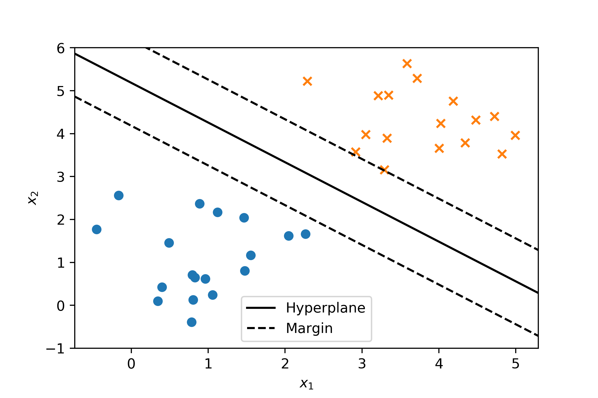
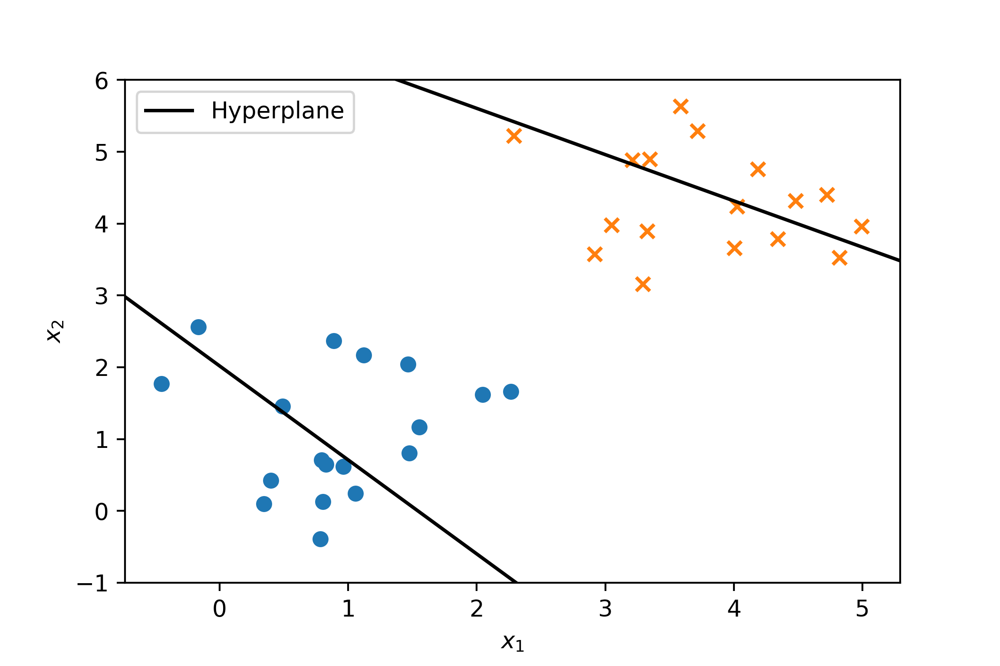

# Abstract
This paper presents the `LightTwinSVM` program and its features. It is a simple and fast implementation of twin support vector machine  algorithm (TwinSVM). Numerical experiments on benchmark datasets shows the effectiveness of the `LightTwinSVM` program in terms of accuracy. This program can be used by researchers, students, and practitioners to solve classifications tasks.

# Introduction

Classification is a widely-used learning method in machine learning. The task of classification consists of training samples for which the class labels are available. On the basis of such training samples, a classifier learns a rule for predicting an unseen sample [@shalev2014]. To do a classification task, many algorithms have been proposed in machine learning literature such as Artificial Neural Network (ANN), Support Vector Machine (SVM), K-nearest neighbors (KNN), and Decision Trees. Among these classification algorithms, SVM classifier has relatively better prediction accuracy and generalization [@kotsiantis2007]. The main idea of SVM is to find the optimal separating hyperplane with the largest margin between the two classes. Figure 1 shows the geometric illustration of SVM classifier.

Over the past decade, researchers have proposed new classifiers based on the SVM [@nayak2015]. Of these extensions of SVM, twin support vector machine (TwinSVM) [@jayadeva2007] has received more attention from scholars in the field of SVM research. This may be due to the novel idea of TwinSVM which is doing classification using two non-parallel hyperplanes. Each of which is as close as possible to samples of its own class and far from samples of the other class. To show the central idea of TwinSVM graphically, Figure 2 shows the geometric illustration of TwinSVM classifier.

SVM has several stable software packages and implementations such as `LIBSVM` [@chang2011libsvm] and `LIBLINEAR` [@fan2008liblinear]. These packages were used to implement SVM in `Scikit-learn` [@pedregosa2011scikit] which is a widely-used machine learning package for Python programming language. To solve a classification problem with the SVM algorithm, one can use `Scikit-learn` with several lines of code in Python.

Even though TwinSVM is a popular classification algorithm in the field of SVM research, to best of our knowledge, it has not a free and reliable implementation with user guide on the internet. This motivated us to develop `LightTwinSVM` program to help researchers, practitioners, and students build their own classifier on the basis of `LightTwinSVM`. Moreover, this program can be used to solve classification problems. In the next section, we present `LightTwinSVM`, its features, and compare it with `Scikit-learn`'s SVM. 

# LightTwinSVM

`LightTwinSVM` program is a simple and fast implementation of TwinSVM classifier. It is mostly written in Python and its main design goals are simplicity and speed. Also, this program is free, open source, and licensed under the terms of GNU GPL v3^[https://opensource.org/licenses/GPL-3.0]. `LightTwinSVM` is built on top of `NumPy` [@walt2011], `Scikit-learn` [@pedregosa2011scikit], and `pandas` [@mckinney2011pandas].

`LightTwinSVM` program can be used by both researchers in the field of SVM research and by students in courses on pattern recognition and machine learning. Moreover, this software can be applied to a wide variety of research applications such as text classification, image or video recognition, medical diagnosis, and bioinformatics. For example, `LightTwinSVM` was used for the numerical experiments in our previous research paper [@mir2018]. 

The main features of the `LightTwinSVM` program are the following:

- To make its usage simple, a **command-line application** was created to help users solve classification tasks step-by-step.
- Since speed is one of the design goals, the **clipDCD optimization algorithm** [@peng2014] is employed which is a simple and fast external optimizer. It was improved and implemented in C++.
- In order to solve linear or non-linear classification problems, both **linear** and **RBF kernels** are supported.
- Multi-class classification problems can be solved using either **One-vs-One** or **One-vs-All** scheme.
- The One-vs-One classifier is **Scikit-learn compatible**. Therefore, `Scikit-learn` tools such as GridSearchCV and cross_val_score can be employed.
- To evaluate the performance of the classifier, **K-fold cross-validation** and **train/test split** are supported.
- The optimal values of hyper-parameters can be found with **grid search**.
- **CSV** and **LIBSVM** formats are supported for importing datasets.
- Detailed classification results are saved in a spreadsheet file so that results can be analyzed and interpreted.

In order to show the efficiency of `LightTwinSVM` program, we conducted experiments and compared it with the implementation of SVM in `Scikit-learn` on UCI^[http://archive.ics.uci.edu/ml/datasets.html] benchmark datasets. Table 1 shows the accuracy comparison between `LightTwinSVM` and `Scikit-learn`'s SVM.

Table: The accuracy comparison between `LightTwinSVM` and `Scikit-learn`'s SVM
| Datasets  | LightTwinSVM | Scikit-learn's SVM | Difference in Accuracy |
| ------------- | ------------- | ------------- | ------------- |
| Pima-Indian  | **78.91** | 78.26 | 0.65 |
| Australian | **87.25** | 86.81 | 0.44 |
| Haberman  | 76.12 | **76.80** | -0.68 |
| Cleveland  | **85.14** | 84.82 | 0.32 |
| Sonar  | **75.16** | 64.42 | 10.74 |
| Heart-Statlog | **85.19** | **85.19** | 0 |
| Hepatitis | **85.81** |83.23 | 2.58 |
| WDBC | **98.24** |98.07 | 0.17 |
| Spectf | **80.55** |79.78 | 0.81 |
| Titanic | **82.04** |81.71 | 0.33 |
| Mean | **83.44** |81.90 | 1.53 |

From the above table, it can be seen that `LightTwinSVM` outperforms `Scikit-learn`'s SVM on most datasets. For instance, the accuracy difference in Sonar dataset is as high as 10.74% which is a significant result. However, one may notice that the difference in accuracy between the two classifiers is not very large. To show whether a significant difference exists, statistical tests are often used in research papers on classification [@demsar2006]. Due to the limited space, comprehensive experiments with statistical tests are skipped in this paper. In summary, the experiment indicates that the `LightTwinSVM` program can be used for classification tasks and it may produce a better prediction accuracy.

The source code of `LightTwinSVM`, its installation guide and usage example can be found at [https://github.com/mir-am/LightTwinSVM](https://github.com/mir-am/LightTwinSVM).

# Acknowledgements
This research work was carried out at the machine learning lab of IranDoc Institution. We would like to thank the director of IranDoc Institution for providing us with research facilities.

# References

